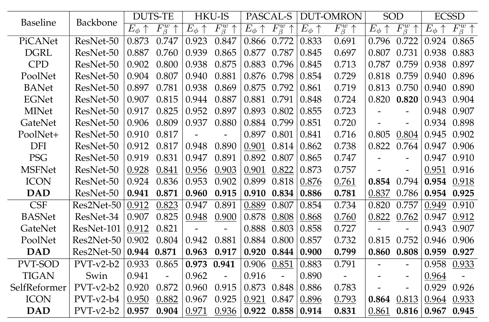

# DAD: Difference-Aware Decoder for Binary Segmentation

This repository contains the code for our paper:  
**[Towards Complex Backgrounds: A Unified Difference-Aware Decoder for Binary Segmentation](https://arxiv.org/abs/2210.15156)**.

## Training Instructions

To train the DAD model, follow these steps:

1. Set the task (COD/SOD/Poly/MSD), batch size, and specify the GPU for training. Run the following commands:

   ```bash
   python train.py --gpu_id 0 --task COD --batchsize 8 --backbone resnet
   python train.py --gpu_id 0 --task COD --batchsize 8 --backbone res2net
   python train.py --gpu_id 0 --task COD --batchsize 8 --backbone v2_b2
   python train.py --gpu_id 0 --task COD --batchsize 8 --backbone v2_b4

## Inference Code and Pretrained Models

We have uploaded the inference code along with pretrained and trained models. You can download them using the links below:

- **Pretrained model**: [Download from BaiduDisk](https://pan.baidu.com/s/1O0jn2RUzDCELLQm6X-HF2w?pwd=41ks) (Access Code: `41ks`)
- **Trained model**: [Download from BaiduDisk](https://pan.baidu.com/s/11vfJWGYxpYSU5zHr_V2KTg?pwd=oazk) (Access Code: `oazk`)

To test the trained models, run the the following command:
```bash
python test.py --task COD --backbone resnet --pth_path './Experiments/DAD/'

## Visual Results for Multiple Tasks and Backbones

We have released visual results for different tasks using various backbones. You can access them from the following links:

### Camouflaged Object Detection


- **ResNet50**: [Download from BaiduDisk](https://pan.baidu.com/s/1DUgW7xUpVgv0C4lKwNjPtg?pwd=2u1y) (Access Code: `2u1y`)
- **Res2Net50**: [Download from BaiduDisk](https://pan.baidu.com/s/1HYrdFyp69Ql3GNvY8FRLuA?pwd=4k47) (Access Code: `4k47`)
- **PVT-v2-b2**: [Download from BaiduDisk](https://pan.baidu.com/s/1fITq29BIU6qT7BPKk8VdDw?pwd=2opt) (Access Code: `2opt`)

### Salient Object Detection

- **ResNet50**: [Download from BaiduDisk](https://pan.baidu.com/s/1McQ--BqJJk1EJFj1_ui2wQ?pwd=nx6j) (Access Code: `nx6j`)
- **Res2Net50**: [Download from BaiduDisk](https://pan.baidu.com/s/18gSvey7ik4okQQ_hZcbQkQ?pwd=mw7n) (Access Code: `mw7n`)
- **PVT-v2-b2**: [Download from BaiduDisk](https://pan.baidu.com/s/1OjWFJ0V-8r_uGVwj2wSApA?pwd=6ok6) (Access Code: `6ok6`)

### Mirror Detection

- **PVT-v2-b2**: [Download from BaiduDisk](https://pan.baidu.com/s/18UY058BY0Ed3PzXcZRAuQw?pwd=m7hx) (Access Code: `m7hx`)

### Polyp Segmentation

- **PVT-v2-b2**: [Download from BaiduDisk](https://pan.baidu.com/s/1ZKFaPi7zUy8OrScfTnATeA?pwd=ruun) (Access Code: `ruun`)

## Citation

If you find our work useful, please consider citing our paper:

```bibtex
@article{YourPaper2022,
  title={Towards Complex Backgrounds: A Unified Difference-Aware Decoder for Binary Segmentation},
  author={Your Name and Co-authors},
  journal={arXiv preprint arXiv:2210.15156},
  year={2022}
}
